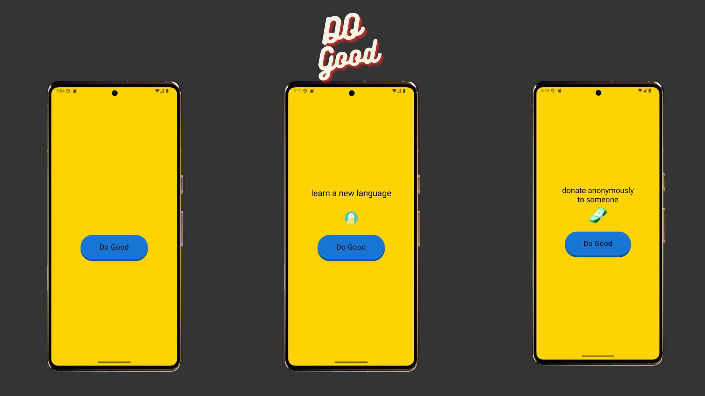

# Do Good App 🌟

Do Good Deeds A Modern Android App Built with Kotlin & Compose”
This project demonstrates modern Android development practices and clean architecture while integrating **Supabase** for backend functionality.

---

## Features

- Perform “Good Deeds” with a single button tap.
- Modern, clean UI built entirely with **Jetpack Compose**.
- Lightweight and easy to extend for further features.

---



---


## Architecture

- **MVVM** - model view viewmodel
-  **modularized** for reusable components.
- Dependency Injection with **Hilt**

---

## Tests

- Unit tests: `./gradlew testDemoDebug`
- Instrumented tests: `./gradlew connectedDemoDebugAndroidTest`

---

## Check It Out

1. Clone the repo:

```bash
git clone https://github.com/KoneMuhammad/dogood.git
